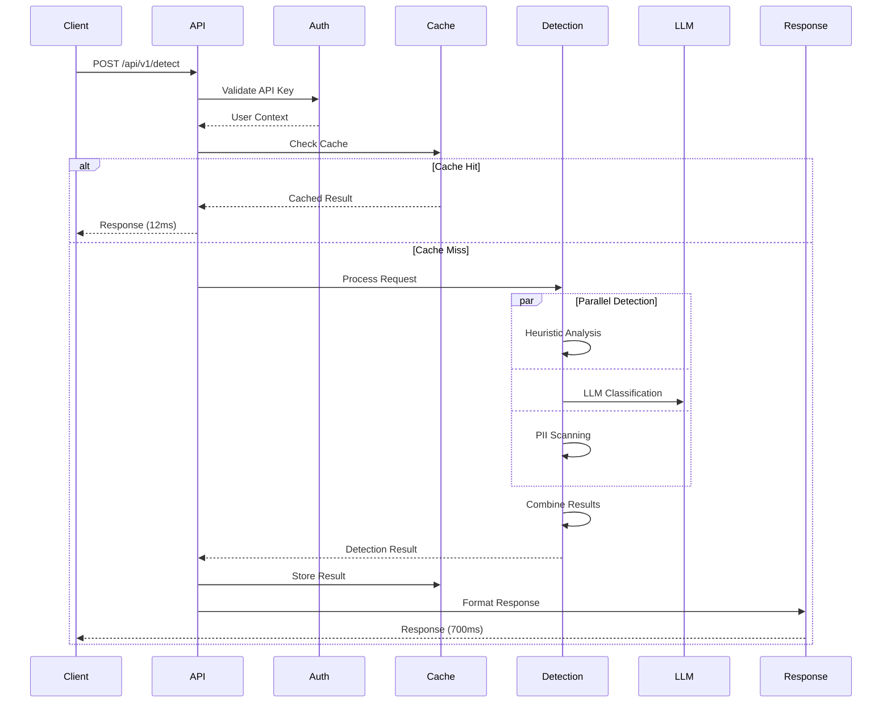

# System Architecture

Deep dive into PromptSentinel's architecture, design decisions, and implementation details.

## Table of Contents
- [Overview](#overview)
- [Core Components](#core-components)
- [Request Flow](#request-flow)
- [Detection Pipeline](#detection-pipeline)
- [Data Models](#data-models)
- [Provider Architecture](#provider-architecture)
- [Caching Strategy](#caching-strategy)
- [Security Architecture](#security-architecture)
- [Performance Architecture](#performance-architecture)
- [Deployment Architecture](#deployment-architecture)
- [Scaling Considerations](#scaling-considerations)

## Overview

PromptSentinel follows a microservice architecture with clear separation of concerns:

```
┌─────────────────────────────────────────────────────────────┐
│                         Clients                             │
│  (Web Apps, Mobile Apps, APIs, SDKs)                       │
└─────────────┬───────────────────────────────────────────────┘
              │
              ▼
┌─────────────────────────────────────────────────────────────┐
│                    API Gateway Layer                        │
│  • Rate Limiting  • Authentication  • Load Balancing        │
└─────────────┬───────────────────────────────────────────────┘
              │
              ▼
┌─────────────────────────────────────────────────────────────┐
│                  PromptSentinel Core                        │
│  ┌─────────────────────────────────────────────────────┐   │
│  │                  FastAPI Application                 │   │
│  │  • Request Validation  • Response Formatting         │   │
│  └─────────────┬───────────────────────────────────────┘   │
│                │                                            │
│  ┌─────────────▼───────────────────────────────────────┐   │
│  │              Detection Pipeline                      │   │
│  │  • Heuristic Engine  • LLM Classifier  • PII Scanner│   │
│  └─────────────┬───────────────────────────────────────┘   │
│                │                                            │
│  ┌─────────────▼───────────────────────────────────────┐   │
│  │                 Provider Layer                       │   │
│  │  • Anthropic  • OpenAI  • Gemini  • Failover Logic  │   │
│  └─────────────────────────────────────────────────────┘   │
└─────────────────────────────────────────────────────────────┘
              │
              ▼
┌─────────────────────────────────────────────────────────────┐
│                    Infrastructure Layer                     │
│  • Redis Cache  • PostgreSQL  • Monitoring  • Logging       │
└─────────────────────────────────────────────────────────────┘
```

### Design Principles

1. **Defense in Depth**: Multiple detection layers for comprehensive protection
2. **High Performance**: Sub-100ms response times with caching
3. **Resilience**: Graceful degradation and provider failover
4. **Scalability**: Horizontal scaling with stateless design
5. **Observability**: Comprehensive monitoring and tracing
6. **Security First**: Zero-trust architecture with encryption

## Core Components

### 1. API Layer

```python
# src/prompt_sentinel/api/router.py
from fastapi import APIRouter, Depends, HTTPException
from typing import Annotated

router = APIRouter(prefix="/api/v1")

class APILayer:
    """Handles HTTP request/response lifecycle."""
    
    def __init__(self):
        self.validators = RequestValidators()
        self.rate_limiter = RateLimiter()
        self.auth = AuthenticationManager()
    
    async def process_request(self, request: Request):
        # 1. Authentication
        user = await self.auth.authenticate(request)
        
        # 2. Rate limiting
        await self.rate_limiter.check(user)
        
        # 3. Request validation
        validated = self.validators.validate(request)
        
        # 4. Route to appropriate handler
        handler = self.get_handler(request.path)
        
        # 5. Process and return response
        response = await handler.process(validated)
        
        return self.format_response(response)
```

### 2. Detection Engine

```python
# src/prompt_sentinel/detection/engine.py
class DetectionEngine:
    """Core detection orchestration engine."""
    
    def __init__(self):
        self.strategies = {
            'heuristic': HeuristicDetector(),
            'llm': LLMClassifier(),
            'pii': PIIScanner(),
            'combined': CombinedStrategy()
        }
        self.router = IntelligentRouter()
    
    async def detect(self, request: DetectionRequest) -> DetectionResponse:
        # 1. Analyze complexity
        complexity = await self.router.analyze_complexity(request)
        
        # 2. Select strategy based on complexity
        strategy = self.router.select_strategy(complexity)
        
        # 3. Execute detection strategy
        results = await self.execute_strategy(strategy, request)
        
        # 4. Combine and score results
        final_verdict = self.combine_results(results)
        
        # 5. Apply post-processing
        response = await self.post_process(final_verdict, request)
        
        return response
    
    async def execute_strategy(self, strategy_name: str, request):
        """Execute selected detection strategy."""
        strategy = self.strategies[strategy_name]
        
        if strategy_name == 'combined':
            # Parallel execution for combined strategy
            tasks = [
                self.strategies['heuristic'].detect(request),
                self.strategies['llm'].detect(request),
                self.strategies['pii'].detect(request)
            ]
            results = await asyncio.gather(*tasks)
            return strategy.combine(results)
        else:
            return await strategy.detect(request)
```

### 3. Heuristic Engine

```python
# src/prompt_sentinel/detection/heuristics.py
class HeuristicDetector:
    """Pattern-based detection using regex and rules."""
    
    def __init__(self):
        self.patterns = self.load_patterns()
        self.compiled_patterns = self.compile_patterns()
    
    def load_patterns(self) -> Dict[str, List[Pattern]]:
        """Load detection patterns from configuration."""
        return {
            'instruction_override': [
                r'ignore\s+(all\s+)?((previous|prior|above).*)?instructions?',
                r'disregard\s+.*instructions?',
                r'forget\s+everything',
            ],
            'data_extraction': [
                r'(show|reveal|display|output).*system\s*prompt',
                r'what\s+is\s+your\s+(initial|system).*prompt',
            ],
            'role_manipulation': [
                r'you\s+are\s+now',
                r'act\s+as\s+if',
                r'pretend\s+to\s+be',
            ],
            'encoding_evasion': [
                r'base64|atob|btoa',
                r'\\x[0-9a-fA-F]{2}',
                r'String\.fromCharCode',
            ]
        }
    
    async def detect(self, text: str) -> HeuristicResult:
        """Perform heuristic detection."""
        matches = []
        
        for category, patterns in self.compiled_patterns.items():
            for pattern in patterns:
                if pattern.search(text):
                    matches.append({
                        'category': category,
                        'pattern': pattern.pattern,
                        'confidence': self.calculate_confidence(category, text)
                    })
        
        return HeuristicResult(
            matches=matches,
            verdict=self.determine_verdict(matches),
            confidence=self.aggregate_confidence(matches)
        )
```

### 4. LLM Classifier

```python
# src/prompt_sentinel/detection/llm_classifier.py
class LLMClassifier:
    """LLM-based detection using multiple providers."""
    
    def __init__(self):
        self.providers = {
            'anthropic': AnthropicProvider(),
            'openai': OpenAIProvider(),
            'gemini': GeminiProvider()
        }
        self.fallback_order = ['anthropic', 'openai', 'gemini']
    
    async def classify(self, text: str) -> ClassificationResult:
        """Classify text using LLM with fallback."""
        
        for provider_name in self.fallback_order:
            try:
                provider = self.providers[provider_name]
                
                # Build classification prompt
                prompt = self.build_prompt(text)
                
                # Call LLM provider
                response = await provider.complete(prompt)
                
                # Parse response
                classification = self.parse_response(response)
                
                return ClassificationResult(
                    verdict=classification['verdict'],
                    confidence=classification['confidence'],
                    reasoning=classification['reasoning'],
                    provider=provider_name
                )
                
            except ProviderError as e:
                logger.warning(f"Provider {provider_name} failed: {e}")
                continue
        
        raise AllProvidersFailedError("All LLM providers failed")
    
    def build_prompt(self, text: str) -> str:
        """Build classification prompt for LLM."""
        return f"""
        Analyze the following text for security threats:
        
        Text: {text}
        
        Classify as:
        - SAFE: No security concerns
        - SUSPICIOUS: Potential threat, needs review
        - MALICIOUS: Clear security threat
        
        Provide confidence (0-1) and reasoning.
        """
```

## Request Flow

### Detailed Request Processing



### Request Lifecycle

1. **Ingress** (5-10ms)
   - TLS termination
   - Load balancer routing
   - Rate limiting check

2. **Authentication** (2-5ms)
   - API key validation
   - User context loading
   - Permission checking

3. **Validation** (1-2ms)
   - Schema validation
   - Input sanitization
   - Size limits checking

4. **Cache Lookup** (1-3ms)
   - Redis key generation
   - Cache retrieval
   - TTL checking

5. **Detection** (50-500ms)
   - Strategy selection
   - Parallel execution
   - Result combination

6. **Response** (2-5ms)
   - Result formatting
   - Cache storage
   - Metrics update

## Detection Pipeline

### Multi-Layer Detection Strategy

```python
# src/prompt_sentinel/detection/pipeline.py
class DetectionPipeline:
    """Multi-layer detection pipeline implementation."""
    
    def __init__(self):
        self.layers = [
            PreprocessingLayer(),
            HeuristicLayer(),
            LLMLayer(),
            PIILayer(),
            PostprocessingLayer()
        ]
    
    async def process(self, request: DetectionRequest) -> DetectionResponse:
        """Process through detection layers."""
        context = DetectionContext(request)
        
        for layer in self.layers:
            # Each layer can modify context or short-circuit
            result = await layer.process(context)
            
            if result.should_terminate:
                # Early termination for high-confidence threats
                return self.build_response(context)
            
            context.add_layer_result(layer.name, result)
        
        # Combine all layer results
        final_verdict = self.verdict_calculator.calculate(context)
        
        return DetectionResponse(
            verdict=final_verdict.verdict,
            confidence=final_verdict.confidence,
            reasons=context.get_all_reasons(),
            metadata=context.metadata
        )

class HeuristicLayer(DetectionLayer):
    """Heuristic pattern matching layer."""
    
    async def process(self, context: DetectionContext) -> LayerResult:
        text = context.get_text()
        
        # Pattern matching
        threats = []
        for pattern_set in self.pattern_sets:
            matches = pattern_set.find_matches(text)
            threats.extend(matches)
        
        # Calculate layer verdict
        if threats:
            max_severity = max(t.severity for t in threats)
            if max_severity >= 0.9:
                # High confidence threat - can terminate early
                return LayerResult(
                    verdict='block',
                    confidence=max_severity,
                    threats=threats,
                    should_terminate=True
                )
        
        return LayerResult(
            verdict='allow' if not threats else 'suspicious',
            confidence=self.calculate_confidence(threats),
            threats=threats
        )
```

### Intelligent Routing

```python
# src/prompt_sentinel/detection/routing.py
class IntelligentRouter:
    """Routes requests to optimal detection strategy."""
    
    def __init__(self):
        self.complexity_analyzer = ComplexityAnalyzer()
        self.strategy_selector = StrategySelector()
    
    async def route(self, request: DetectionRequest) -> str:
        """Determine optimal routing strategy."""
        
        # Analyze prompt characteristics
        features = await self.extract_features(request)
        
        # Calculate complexity score
        complexity = self.complexity_analyzer.analyze(features)
        
        # Select strategy based on complexity
        if complexity.score < 0.2:
            # Simple prompts - heuristics only
            return 'heuristic_only'
        elif complexity.score < 0.5:
            # Moderate - heuristics + cached LLM
            return 'balanced'
        elif complexity.score < 0.8:
            # Complex - full analysis
            return 'comprehensive'
        else:
            # Critical - maximum security
            return 'paranoid'
    
    async def extract_features(self, request) -> Features:
        """Extract features for complexity analysis."""
        text = request.get_text()
        
        return Features(
            length=len(text),
            token_count=self.count_tokens(text),
            special_chars=self.count_special_chars(text),
            encoding_detected=self.detect_encoding(text),
            nested_instructions=self.detect_nesting(text),
            role_switches=self.count_role_switches(text),
            suspicious_patterns=self.count_suspicious_patterns(text)
        )
```

## Data Models

### Core Data Structures

```python
# src/prompt_sentinel/models/core.py
from pydantic import BaseModel, Field
from typing import List, Optional, Literal
from datetime import datetime

class Message(BaseModel):
    """Role-based message for conversations."""
    role: Literal['system', 'user', 'assistant']
    content: str
    metadata: Optional[dict] = None

class DetectionRequest(BaseModel):
    """Incoming detection request."""
    prompt: Optional[str] = None
    messages: Optional[List[Message]] = None
    detection_mode: Literal['strict', 'moderate', 'permissive'] = 'moderate'
    check_format: bool = False
    use_cache: bool = True
    use_intelligent_routing: bool = False
    metadata: Optional[dict] = None
    
    class Config:
        schema_extra = {
            "example": {
                "prompt": "Translate this to French",
                "detection_mode": "moderate",
                "use_cache": True
            }
        }

class ThreatReason(BaseModel):
    """Detailed threat information."""
    category: str
    description: str
    confidence: float = Field(ge=0.0, le=1.0)
    source: Literal['heuristic', 'llm', 'pii', 'combined']
    patterns_matched: Optional[List[str]] = None
    metadata: Optional[dict] = None

class PIIDetection(BaseModel):
    """PII detection result."""
    type: str  # 'email', 'phone', 'ssn', etc.
    value: str  # Original value (for logging)
    masked_value: str  # Redacted version
    start_pos: int
    end_pos: int
    confidence: float

class DetectionResponse(BaseModel):
    """Detection result response."""
    verdict: Literal['allow', 'block', 'review']
    confidence: float = Field(ge=0.0, le=1.0)
    reasons: List[ThreatReason] = []
    pii_detected: Optional[List[PIIDetection]] = None
    modified_prompt: Optional[str] = None
    format_recommendations: Optional[List[str]] = None
    complexity_analysis: Optional[dict] = None
    detection_strategy: Optional[str] = None
    processing_time_ms: float
    cached: bool = False
    metadata: Optional[dict] = None
```

### Internal State Management

```python
# src/prompt_sentinel/models/state.py
class DetectionContext:
    """Maintains state through detection pipeline."""
    
    def __init__(self, request: DetectionRequest):
        self.request = request
        self.start_time = time.time()
        self.layer_results = {}
        self.metadata = {}
        self.cache_key = self.generate_cache_key()
    
    def generate_cache_key(self) -> str:
        """Generate deterministic cache key."""
        content = self.request.prompt or str(self.request.messages)
        mode = self.request.detection_mode
        
        return hashlib.sha256(
            f"{content}:{mode}".encode()
        ).hexdigest()
    
    def add_layer_result(self, layer_name: str, result: LayerResult):
        """Store layer processing result."""
        self.layer_results[layer_name] = result
        self.metadata[f"{layer_name}_time_ms"] = result.processing_time
    
    def get_combined_confidence(self) -> float:
        """Calculate combined confidence score."""
        if not self.layer_results:
            return 0.0
        
        # Weighted average based on layer importance
        weights = {
            'heuristic': 0.3,
            'llm': 0.5,
            'pii': 0.2
        }
        
        total_weight = 0
        weighted_sum = 0
        
        for layer, result in self.layer_results.items():
            weight = weights.get(layer, 0.1)
            weighted_sum += result.confidence * weight
            total_weight += weight
        
        return weighted_sum / total_weight if total_weight > 0 else 0.0
```

## Provider Architecture

### Provider Abstraction Layer

```python
# src/prompt_sentinel/providers/base.py
from abc import ABC, abstractmethod

class LLMProvider(ABC):
    """Abstract base class for LLM providers."""
    
    def __init__(self, config: ProviderConfig):
        self.config = config
        self.client = self.initialize_client()
        self.metrics = ProviderMetrics()
    
    @abstractmethod
    async def initialize_client(self):
        """Initialize provider-specific client."""
        pass
    
    @abstractmethod
    async def classify(self, prompt: str) -> ClassificationResult:
        """Perform security classification."""
        pass
    
    @abstractmethod
    async def health_check(self) -> bool:
        """Check provider availability."""
        pass
    
    async def complete_with_retry(self, prompt: str, max_retries: int = 3):
        """Complete with exponential backoff retry."""
        for attempt in range(max_retries):
            try:
                return await self.complete(prompt)
            except ProviderError as e:
                if attempt == max_retries - 1:
                    raise
                
                wait_time = 2 ** attempt
                await asyncio.sleep(wait_time)

# src/prompt_sentinel/providers/anthropic.py
class AnthropicProvider(LLMProvider):
    """Anthropic Claude provider implementation."""
    
    async def initialize_client(self):
        """Initialize Anthropic client."""
        import anthropic
        
        return anthropic.AsyncAnthropic(
            api_key=self.config.api_key,
            max_retries=0  # We handle retries
        )
    
    async def classify(self, prompt: str) -> ClassificationResult:
        """Classify using Claude."""
        try:
            response = await self.client.messages.create(
                model=self.config.model or "claude-3-sonnet-20240229",
                max_tokens=150,
                temperature=0,
                system=self.get_system_prompt(),
                messages=[{
                    "role": "user",
                    "content": f"Analyze for security threats: {prompt}"
                }]
            )
            
            return self.parse_claude_response(response)
            
        except Exception as e:
            self.metrics.record_error(e)
            raise ProviderError(f"Anthropic classification failed: {e}")
```

### Provider Manager

```python
# src/prompt_sentinel/providers/manager.py
class ProviderManager:
    """Manages multiple LLM providers with failover."""
    
    def __init__(self, config: Config):
        self.providers = self.initialize_providers(config)
        self.fallback_order = config.provider_order
        self.health_checker = ProviderHealthChecker()
    
    def initialize_providers(self, config) -> Dict[str, LLMProvider]:
        """Initialize all configured providers."""
        providers = {}
        
        if config.anthropic_api_key:
            providers['anthropic'] = AnthropicProvider(
                ProviderConfig(api_key=config.anthropic_api_key)
            )
        
        if config.openai_api_key:
            providers['openai'] = OpenAIProvider(
                ProviderConfig(api_key=config.openai_api_key)
            )
        
        if config.gemini_api_key:
            providers['gemini'] = GeminiProvider(
                ProviderConfig(api_key=config.gemini_api_key)
            )
        
        return providers
    
    async def classify_with_fallback(self, prompt: str) -> ClassificationResult:
        """Classify with automatic provider fallback."""
        errors = []
        
        for provider_name in self.fallback_order:
            if provider_name not in self.providers:
                continue
            
            provider = self.providers[provider_name]
            
            # Check provider health
            if not await self.health_checker.is_healthy(provider_name):
                errors.append(f"{provider_name}: unhealthy")
                continue
            
            try:
                result = await provider.classify(prompt)
                result.provider = provider_name
                return result
                
            except ProviderError as e:
                errors.append(f"{provider_name}: {str(e)}")
                await self.health_checker.mark_unhealthy(provider_name)
                continue
        
        raise AllProvidersFailedError(f"All providers failed: {errors}")
```

## Caching Strategy

### Multi-Layer Caching

```python
# src/prompt_sentinel/cache/strategy.py
class CacheStrategy:
    """Multi-layer caching implementation."""
    
    def __init__(self, config: CacheConfig):
        self.memory_cache = MemoryCache(max_size=1000)
        self.redis_cache = RedisCache(config.redis_url) if config.redis_url else None
        self.ttl = config.ttl
    
    async def get(self, key: str) -> Optional[DetectionResponse]:
        """Get from cache with fallback layers."""
        
        # L1: Memory cache (fastest)
        result = self.memory_cache.get(key)
        if result:
            self.metrics.record_hit('memory')
            return result
        
        # L2: Redis cache
        if self.redis_cache:
            result = await self.redis_cache.get(key)
            if result:
                # Promote to memory cache
                self.memory_cache.set(key, result)
                self.metrics.record_hit('redis')
                return result
        
        self.metrics.record_miss()
        return None
    
    async def set(self, key: str, value: DetectionResponse):
        """Set in all cache layers."""
        
        # Set in memory cache
        self.memory_cache.set(key, value, ttl=self.ttl)
        
        # Set in Redis cache
        if self.redis_cache:
            await self.redis_cache.set(key, value, ttl=self.ttl)

class MemoryCache:
    """In-memory LRU cache implementation."""
    
    def __init__(self, max_size: int):
        self.cache = OrderedDict()
        self.max_size = max_size
        self.lock = threading.Lock()
    
    def get(self, key: str) -> Optional[Any]:
        """Get with LRU update."""
        with self.lock:
            if key in self.cache:
                # Move to end (most recent)
                self.cache.move_to_end(key)
                return self.cache[key]['value']
            return None
    
    def set(self, key: str, value: Any, ttl: int = 3600):
        """Set with eviction."""
        with self.lock:
            # Evict if at capacity
            if len(self.cache) >= self.max_size:
                self.cache.popitem(last=False)  # Remove oldest
            
            self.cache[key] = {
                'value': value,
                'expires_at': time.time() + ttl
            }
```

### Cache Key Generation

```python
# src/prompt_sentinel/cache/keys.py
class CacheKeyGenerator:
    """Generates deterministic cache keys."""
    
    @staticmethod
    def generate(request: DetectionRequest) -> str:
        """Generate cache key from request."""
        
        # Normalize content
        if request.prompt:
            content = request.prompt.lower().strip()
        else:
            content = json.dumps(
                [{'role': m.role, 'content': m.content} 
                 for m in request.messages],
                sort_keys=True
            )
        
        # Include relevant parameters
        params = {
            'mode': request.detection_mode,
            'format': request.check_format,
            'routing': request.use_intelligent_routing
        }
        
        # Generate hash
        key_data = f"{content}:{json.dumps(params, sort_keys=True)}"
        return f"ps:v1:{hashlib.sha256(key_data.encode()).hexdigest()}"
```

## Security Architecture

### Defense in Depth

```python
# src/prompt_sentinel/security/layers.py
class SecurityLayers:
    """Multi-layer security implementation."""
    
    def __init__(self):
        self.layers = [
            InputValidationLayer(),
            AuthenticationLayer(),
            RateLimitingLayer(),
            EncryptionLayer(),
            AuditLoggingLayer()
        ]
    
    async def process(self, request: Request) -> Request:
        """Process through security layers."""
        
        for layer in self.layers:
            request = await layer.process(request)
            
            if request.blocked:
                raise SecurityException(
                    f"Blocked by {layer.name}: {request.block_reason}"
                )
        
        return request

class InputValidationLayer(SecurityLayer):
    """Input validation and sanitization."""
    
    async def process(self, request: Request) -> Request:
        # Size limits
        if len(request.body) > self.max_size:
            request.blocked = True
            request.block_reason = "Request too large"
            return request
        
        # Character validation
        if self.contains_null_bytes(request.body):
            request.blocked = True
            request.block_reason = "Invalid characters"
            return request
        
        # SQL injection prevention
        if self.detect_sql_injection(request.body):
            request.blocked = True
            request.block_reason = "SQL injection attempt"
            return request
        
        # Sanitize input
        request.body = self.sanitize(request.body)
        
        return request
```

### Encryption

```python
# src/prompt_sentinel/security/encryption.py
from cryptography.fernet import Fernet
from cryptography.hazmat.primitives import hashes
from cryptography.hazmat.primitives.kdf.pbkdf2 import PBKDF2

class EncryptionManager:
    """Handles encryption for sensitive data."""
    
    def __init__(self, master_key: str):
        self.cipher = self.create_cipher(master_key)
    
    def create_cipher(self, master_key: str) -> Fernet:
        """Create cipher from master key."""
        kdf = PBKDF2(
            algorithm=hashes.SHA256(),
            length=32,
            salt=b'stable_salt',  # Use proper salt in production
            iterations=100000,
        )
        key = base64.urlsafe_b64encode(
            kdf.derive(master_key.encode())
        )
        return Fernet(key)
    
    def encrypt_sensitive(self, data: str) -> str:
        """Encrypt sensitive data."""
        return self.cipher.encrypt(data.encode()).decode()
    
    def decrypt_sensitive(self, encrypted: str) -> str:
        """Decrypt sensitive data."""
        return self.cipher.decrypt(encrypted.encode()).decode()
```

## Performance Architecture

### Optimization Strategies

```python
# src/prompt_sentinel/performance/optimizations.py
class PerformanceOptimizer:
    """Performance optimization strategies."""
    
    def __init__(self):
        self.connection_pool = ConnectionPool()
        self.thread_pool = ThreadPoolExecutor(max_workers=10)
        self.process_pool = ProcessPoolExecutor(max_workers=4)
    
    async def optimize_detection(self, request: DetectionRequest):
        """Apply performance optimizations."""
        
        # 1. Early termination for cached results
        if request.use_cache:
            cached = await self.cache.get(request)
            if cached:
                return cached
        
        # 2. Parallel execution for independent operations
        tasks = []
        
        if self.should_run_heuristics(request):
            tasks.append(self.run_heuristics(request))
        
        if self.should_run_llm(request):
            tasks.append(self.run_llm_classification(request))
        
        if self.should_run_pii(request):
            tasks.append(self.run_pii_scan(request))
        
        results = await asyncio.gather(*tasks)
        
        # 3. CPU-intensive work in process pool
        final_result = await self.loop.run_in_executor(
            self.process_pool,
            self.combine_results,
            results
        )
        
        return final_result
```

### Connection Pooling

```python
# src/prompt_sentinel/performance/pooling.py
class ConnectionPool:
    """HTTP connection pooling for providers."""
    
    def __init__(self, config: PoolConfig):
        self.pools = {}
        self.config = config
    
    def get_session(self, provider: str) -> aiohttp.ClientSession:
        """Get or create session for provider."""
        
        if provider not in self.pools:
            connector = aiohttp.TCPConnector(
                limit=self.config.max_connections,
                limit_per_host=self.config.max_per_host,
                ttl_dns_cache=300
            )
            
            timeout = aiohttp.ClientTimeout(
                total=self.config.timeout,
                connect=self.config.connect_timeout
            )
            
            self.pools[provider] = aiohttp.ClientSession(
                connector=connector,
                timeout=timeout
            )
        
        return self.pools[provider]
```

## Deployment Architecture

### Container Architecture

```dockerfile
# Multi-stage build for optimization
FROM python:3.11-slim AS builder

WORKDIR /app
COPY requirements.txt .
RUN pip install --no-cache-dir -r requirements.txt

FROM python:3.11-slim

# Security: Non-root user
RUN useradd -m -U promptsentinel

WORKDIR /app
COPY --from=builder /usr/local/lib/python3.11/site-packages \
                    /usr/local/lib/python3.11/site-packages
COPY --chown=promptsentinel:promptsentinel . .

USER promptsentinel

# Health check
HEALTHCHECK --interval=30s --timeout=3s \
    CMD python -c "import requests; requests.get('http://localhost:8080/health')"

EXPOSE 8080

CMD ["uvicorn", "main:app", "--host", "0.0.0.0", "--port", "8080", "--workers", "4"]
```

### Kubernetes Architecture

```yaml
# kubernetes/architecture.yaml
apiVersion: v1
kind: Service
metadata:
  name: promptsentinel
spec:
  selector:
    app: promptsentinel
  ports:
  - port: 80
    targetPort: 8080
  type: LoadBalancer

---
apiVersion: apps/v1
kind: Deployment
metadata:
  name: promptsentinel
spec:
  replicas: 3
  strategy:
    type: RollingUpdate
    rollingUpdate:
      maxSurge: 1
      maxUnavailable: 0
  template:
    spec:
      affinity:
        podAntiAffinity:
          preferredDuringSchedulingIgnoredDuringExecution:
          - weight: 100
            podAffinityTerm:
              topologyKey: kubernetes.io/hostname
      containers:
      - name: promptsentinel
        image: promptsentinel:latest
        resources:
          requests:
            memory: "1Gi"
            cpu: "500m"
          limits:
            memory: "2Gi"
            cpu: "1000m"
        livenessProbe:
          httpGet:
            path: /health
            port: 8080
          initialDelaySeconds: 30
        readinessProbe:
          httpGet:
            path: /health/ready
            port: 8080
          initialDelaySeconds: 5
```

## Scaling Considerations

### Horizontal Scaling

```python
# src/prompt_sentinel/scaling/horizontal.py
class HorizontalScaler:
    """Manages horizontal scaling strategies."""
    
    def __init__(self):
        self.metrics = ScalingMetrics()
        self.autoscaler = AutoScaler()
    
    def calculate_required_instances(self) -> int:
        """Calculate required instance count."""
        
        # Get current metrics
        current_load = self.metrics.get_current_load()
        avg_response_time = self.metrics.get_avg_response_time()
        queue_depth = self.metrics.get_queue_depth()
        
        # Calculate based on multiple factors
        load_based = math.ceil(current_load / self.target_load_per_instance)
        latency_based = math.ceil(avg_response_time / self.target_latency)
        queue_based = math.ceil(queue_depth / self.max_queue_per_instance)
        
        # Take maximum to ensure all constraints are met
        required = max(load_based, latency_based, queue_based)
        
        # Apply min/max bounds
        return max(self.min_instances, min(required, self.max_instances))
```

### Vertical Scaling

```yaml
# Resource optimization based on workload
resources:
  # Light workload
  light:
    requests:
      memory: "512Mi"
      cpu: "250m"
    limits:
      memory: "1Gi"
      cpu: "500m"
  
  # Standard workload
  standard:
    requests:
      memory: "1Gi"
      cpu: "500m"
    limits:
      memory: "2Gi"
      cpu: "1000m"
  
  # Heavy workload
  heavy:
    requests:
      memory: "2Gi"
      cpu: "1000m"
    limits:
      memory: "4Gi"
      cpu: "2000m"
```

### Database Scaling

```python
# src/prompt_sentinel/scaling/database.py
class DatabaseScaling:
    """Database scaling strategies."""
    
    def __init__(self):
        self.read_replicas = []
        self.write_primary = None
        self.load_balancer = ReadReplicaBalancer()
    
    async def read(self, query: str):
        """Read from replica with load balancing."""
        replica = self.load_balancer.get_replica()
        return await replica.execute(query)
    
    async def write(self, query: str):
        """Write to primary."""
        return await self.write_primary.execute(query)
    
    def add_read_replica(self, connection_string: str):
        """Add read replica for scaling."""
        replica = DatabaseConnection(connection_string)
        self.read_replicas.append(replica)
        self.load_balancer.update_replicas(self.read_replicas)
```

## Best Practices

1. **Use connection pooling** for all external services
2. **Implement circuit breakers** for provider failover
3. **Cache aggressively** but with proper TTLs
4. **Monitor everything** with structured metrics
5. **Design for failure** with graceful degradation
6. **Secure by default** with defense in depth
7. **Optimize hot paths** with profiling
8. **Document decisions** in ADRs
9. **Test at scale** with load testing
10. **Plan for growth** with scalable architecture

## Additional Resources

- [API Documentation](./API_EXAMPLES.md)
- [Deployment Guide](./DEPLOYMENT_BEST_PRACTICES.md)
- [Monitoring Setup](./MONITORING.md)
- [Security Considerations](../README.md#security)
- [Performance Tuning](./PERFORMANCE.md)